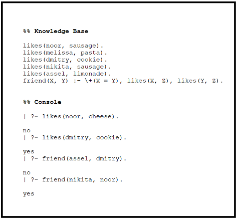

Logic Programming in Python
================

## Logic Programming

Logic programming is a programming paradigm in which the program
statements are **facts** and **rules** about some domain and the program
is expected to answer questions and search for and infer **rule-based**
solutions using this knowledge. Logic programming was widely used in
what was known as Expert Systems. It was also accompanied by the term
**“Symbolic AI”** which was the AI of that era till the 80s or
something before the revolution of the Neural Networks.

##### Prolog Programming Language

major logic programming language is Prolog. Prolog syntax is so simple,
you define a database and in the console you ask question and the
program answers it.



As you can see in the picture above, there facts like *“Noor likes
sausage”* and *“Dmitry like cookie”*, and a rule which is *“if two
persons x and y love the same food, then they are friends”*. In the
console you start to ask the system and it answers.

The power of Prolog comes when you have a huge amount of facts and rules
that it can be impossible to search for or infer a solution. Prolog
shines then, as it is able quickly to reason from the data it has, the
best solutions that you’re asking for fast.

It has been used in games and early chatbots. It is used now in
IBM-Watson along with other technologies.

Major drawback of Prolog, and Logic Programming Languages in general, is
that it doesn’t connect so well with other technologies. Another one is
that you need to write all the facts and rules, and this becomes
impossible when the data is huge as it is nowadays.

In this post we will try to explore how we can use python as a Logic
language using the [logpy](https://github.com/logpy/logpy) library. It
enables us to approach problems as rules and facts like in Prolog but
from within python.

First we need to install the package “*pip install kanren*” and import
it. The name of the library is now Kanren yes :D. because it uses the
[MiniKanren](http://minikanren.org/) approach and it’s merged with some
other libraries.

``` python
from kanren import *
```

Let’s begin with a simple food type and flavor problem. Here how the
code would look like in Prolog.

``` prolog
food_type(gouda, cheese). %% fact
food_type(ritz, cracker). %% fact etc.
food_type(steak, meat).
food_type(sausage, meat).
food_type(limonade, juice).
food_type(cookie, dessert).

flavor(sweet, dessert).
flavor(savory, meat).
flavor(savory, cheese).
flavor(sweet, juice).

food_flavor(X, Y) :- food_type(X, Z), flavor(Y, Z). %% rule

food_flavor(What, sweet). %% question: what food has sweet taste?

%% What = limonade ? ; %% values of What 

%% What = cookie ? ;

%% no
```

Now let’s mimic this in python.

``` python
food_type = Relation() #initiate relations class to construct the facts
flavor = Relation()

facts(food_type, ("gouda", "cheese"), # facts
                 ("ritz", "cracker"),
                 ("steak", "meat"),
                 ("sausage", "meat"),
                 ("limonade", "juice"),
                 ("cookie", "dessert"))

facts(flavor, ("sweet", "dessert"),
              ("savory", "meat"),
              ("savory", "cheese"),
              ("sweet", "juice"))

food_flavor, food_v, flavor_v = var(), var(), var() # define the variables to use in the search

run(0, food_flavor, food_type(food_flavor, food_v), #run the search
                    flavor("sweet", food_v))
## ('limonade', 'cookie')
```

run function takes 3 arguments, 1) the number of solutions you want: as
you saw the answer is two-value tuple, because you put 0 which returns
everything, you can assign 1 to return only 1 value or 2 etc. 2) the
variable you want to search for. 3) the rules for the search.

**We can do the search in another more reproducible appraoch which is to
define a function. Here it comes the power of combining the Logic
Paradigm with Python. We can define functions to do the rule-based
searching and we can loop over DataFrames, files etc to construct rules
and facts without writing them all.**

``` python
def food_flavor(x, y):
    z = var()
    #return lall(food_type(x, z), flavor(y, z)) #lall logical all
    # conde condition takes a tuple with a coma (x, y) to express if x and y
    # or can be expressed with multiple tuples like this ((x), (y))
    return conde((food_type(x, z), flavor(y, z)))

what = var() # the variable we will search for
print(run(0, what, food_flavor(what, "sweet")))
# ('limonade', 'cookie')

print(run(0, what, food_flavor(what, "savory")))
# ('steak', 'sausage', 'gouda')
```

Let’s define some other facts and rules.

In Prolog it would be.

``` prolog
likes(noor, sausage).
likes(melissa, pasta).
likes(dmitry, cookie).
likes(nikita, sausage).
likes(assel, limonade).

friend(X, Y) :- likes(X, Z), likes(Y, Z), \+(X = Y).
```

The same facts and rules in python.

``` python
likes = Relation()
facts(likes, ("Noor", "sausage"),
             ("Melissa", "pasta"),
             ("Dmitry", "cookie"),
             ("Nikita", "sausage"),
             ("Assel", "limonade"))

def friend(x, y): ## let's search for friends who like the same dish
    z = var()
    return conde((likes(x, z), likes(y, z)))

# Who is friend of Noor?
who = var()
name = "Noor"
output = run(0, who, friend(who, name))
print([x for x in output if x != name])
#['Nikita']
```

Let’s go beyond just searching and used some rule-based inference to
recommend a dish to a person. We will use these rules: *if someone likes
a dish of a certain type that has a certain flavor, so most probably
they would like other dishes with the same flavor.*

Let’s define this in python.

``` python
def dish_to_like(person, what):
    liked = var()
    foodtype = var()
    foodflavor = var()
    return lall(likes(person, liked), food_type(liked, foodtype), 
                flavor(foodflavor, foodtype), food_flavor(what, foodflavor))

## let's recommend a dish to Noor who already liked sausage 
what = var()
dish = run(0, what, dish_to_like("Noor", what))
print("since Noor has liked Sausage, he would like:", dish)

#since Noor has liked Sausage, he would like: ('gouda', 'steak', 'sausage')
```

Perfect\! of course this can be infered by eyes because it is a very
small data, but imagine a large one. It would be awesome.

What I like the most about Prolog and Logic Programming in general is
its ability to solve puzzles and riddles. It is amazing, you just need
to construct the rules of the puzzle and the program will come up with
the solutions in seconds.

Let’s try to solve the famous [Zebra
Riddle](https://en.wikipedia.org/wiki/Zebra_Puzzle).

First here are the rules that we need to construct in the program.


The puzzle is to answer two questions using this knowledge: Who drinks water? and who owns the Zebra?

Before begining to define the facts and rules. I want to explain some
useful functions in logpy. **eq()** and **membero()**

**eq()** means equal. It takes two arguments and match them together.
For example:

``` python
x = var()
run(0, x, eq(x, y),
          eq(y, 5))
# (5,)
```

It gave us the value of x without needing to know what y is. It just
infered the value from the fact that x =y and y = 5.

You can use inequal this way *eq(x \!= y, True)*

**membero()** means member of. It takes also two arguments and set a
rule that a value is a member of a set. For example:

``` python
run(2, x, membero(x, (1, 2, 3)),  # x is a member of (1, 2, 3)
          membero(x, (2, 3, 4)))  # x is a member of (2, 3, 4)
# (2, 3)
```

It gave the possible values of x.

It is powerful in infering without so much code\!

Now let’s define the rules of the game and see how to solve it.

``` python
# first define the right function which will set something to the right side of other things
def right(x, y, lst):
    # dict(zip([1, 2, 3], [2, 3])) ==>  {1: 2, 2: 3}
    return membero((x, y), zip(lst[1:], lst))

# next function will check if two things next to each other    
def next(x, y, lst):
    # they are next to each other if x is to y right OR y is to x right
    return conde([right(x, y, lst)], [right(y, x, lst)])

# houses
houses = var()

# puzzle rules
zebra_riddle = lall(
   # houses is equal to 5 var as there are 5 houses
   (eq, (var(), var(), var(), var(), var()), houses),
   # house members
   (membero,('Englishman', var(), var(), var(), 'red'), houses),
   (membero,('Spaniard', var(), var(), 'dog', var()), houses),
   (membero,('Ukrainian', var(), 'tea', var(), var()), houses),
   # put to the right
   (right,(var(), var(), var(), var(), 'ivory'),
    (var(), var(), var(), var(), 'green'), houses),
   (membero,(var(), var(), 'coffee', var(), 'green'), houses),
   (membero,(var(), 'Old Gold', var(), 'snails', var()), houses),
   (membero,(var(), 'Kools', var(), var(), 'yellow'), houses),
   # define the milk house as a 5-var tuple in the middle of the 5-var houses
   (eq,(var(), var(), (var(), var(), 'milk', var(), var()), var(), var()), houses),
   # the same with the Norwegian in the first
   (eq,(('Norwegian', var(), var(), var(), var()), var(), var(), var(), var()), houses),
   # check next to
   (next,(var(), 'Chesterfield', var(), var(), var()),
    (var(), var(), var(), 'fox', var()), houses),
   (next,(var(), 'Kools', var(), var(), var()),
    (var(), var(), var(), 'horse', var()), houses),
   (membero,(var(), 'Lucky Strike', 'Orange Juice', var(), var()), houses),
   (membero,('Japanese', "Parliaments", var(), var(), var()), houses),
   (next,('Norwegian', var(), var(), var(), var()),
    (var(), var(), var(), var(), 'blue'), houses),
   # insert the water and zebra houses
   (membero,(var(), var(), "water", var(), var()), houses),
   (membero,(var(), var(), var(), 'zebra', var()), houses)
)

# run the rules to see the houses structures.
run(0, houses, zebra_riddle)

# ((('Norwegian', 'Kools', 'water', 'fox', 'yellow'),
#   ('Ukrainian', 'Chesterfield', 'tea', 'horse', 'blue'),
#   ('Englishman', 'Old Gold', 'milk', 'snails', 'red'),
#   ('Japanese', 'Parliaments', 'coffee', 'zebra', 'green'),
#   ('Spaniard', 'Lucky Strike', 'Orange Juice', 'dog', 'ivory')),)
```

These are the structure of the houses and easily we can answer the
questions; The Norwegian drinks water and the Japanese owns the Zebra.

The Logic Programming is fascinating and just imagine its power in
infering and reasoning accompanied by the power of the neural networks.
In fact it is a new field of research called **Neuro-Symbolic A.I.**.
